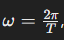

# Programming in Science - Lab 3

This template repository is the starter project for Programming in Science Lab 3. Written in Python, and tested with Pytest.

### Question(s)

1. Write a function that converts polar coordinates (r,θ) to Cartesian coordinates (x,y) using the following formulas. Return the coordinates in a tuple and round the result with 5 decimal points:

2. Write a function that converts Cartesian coordinates (x,y) to polar coordinates (r,θ) using the following formulas. Return the coordinates in a tuple and round the result with 5 decimal points:

3. Oscillatory motion is periodic motion that repeats itself over time, like a pendulum, a vibrating string, or a mass on a spring. In physics, it is often described using the equation: 

or

Where, 

- `x` is the displacement at time `t`.  
- `A` is the amplitude (maximum displacement).  
- `𝜔` is the angular frequency (`𝜔 = 2𝜋𝑓`).  

And where,  

- `f` is the frequency.  
- `t` is the time in seconds.  
- `ϕ` is the phase shift.  

### Run Command

`pytest`
